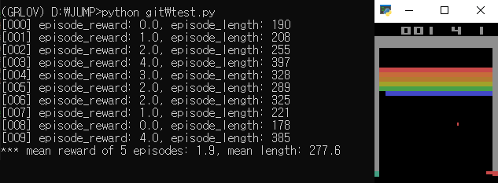

# Deep Q Learning
Deep Q Learning on Atari Breakout

## Intro
This is for studying reinforcement learning in simulation space.

## Installation guide
- environment
```
- Windows10
- nvidia-dirver 461.72
- cuda 11.1
- cuDNN 8.0.5
- pytorch 1.7.1
```
- installation guide for pytorch
```
conda create -n <env_name> python=3.8
conda activate <env_name> 
conda install pytorch torchvision torchaudio cudatoolkit=11.0 -c pytorch
```
- installation guide for atari 
```
pip install "gym[atari]"
pip install pygame
pip uninstall atari_py
pip install --no-index -f https://github.com/Kojoley/atari-py/releases atari_py
```
## Demo
- Random test      


## Contributors
이주용 안석준